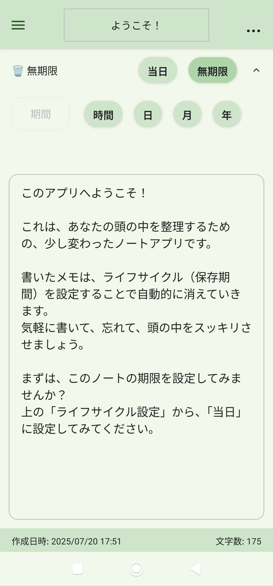
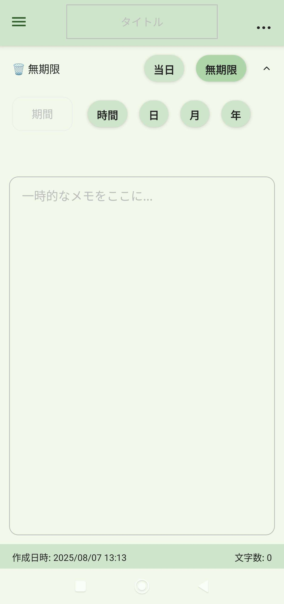
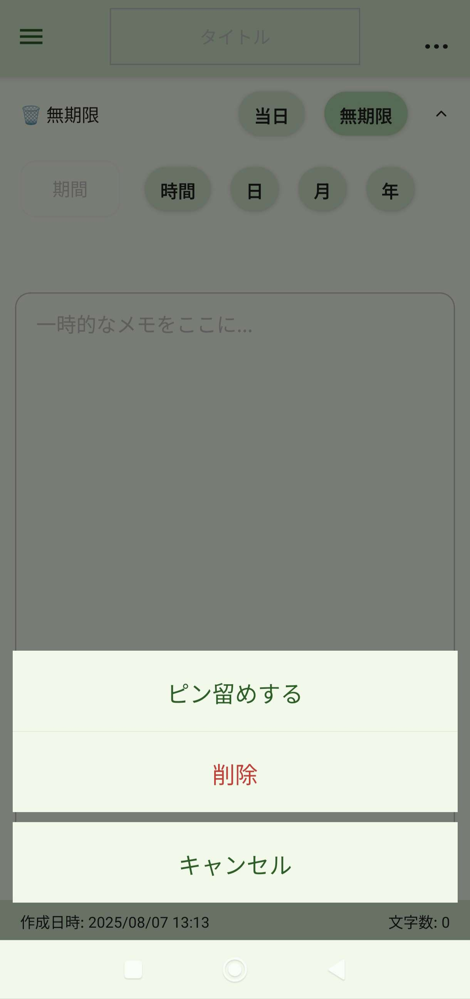
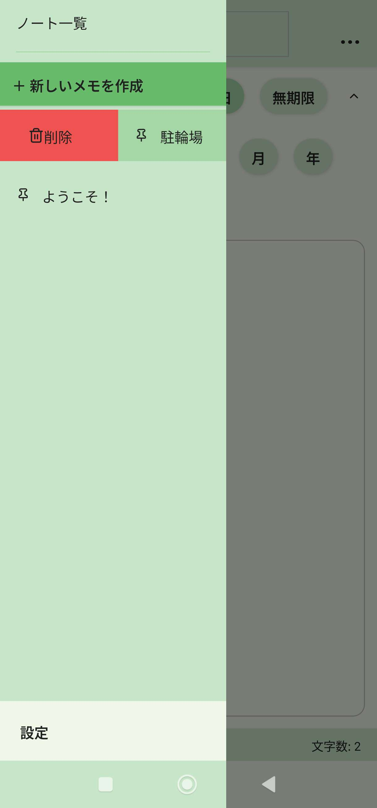
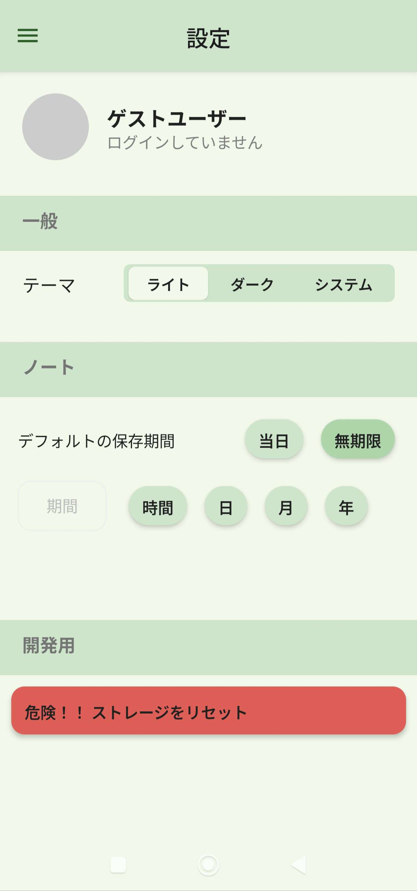
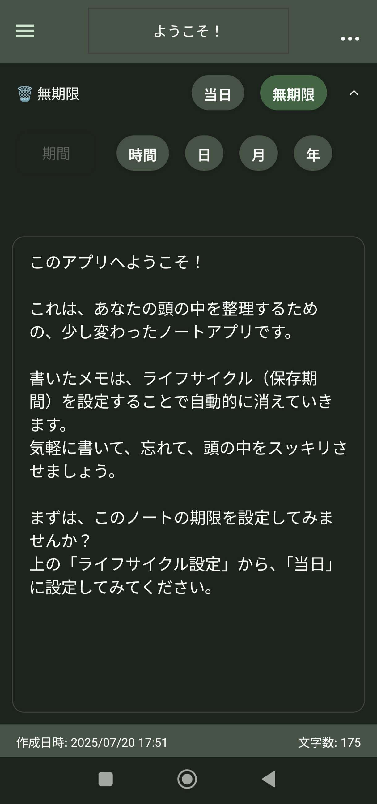
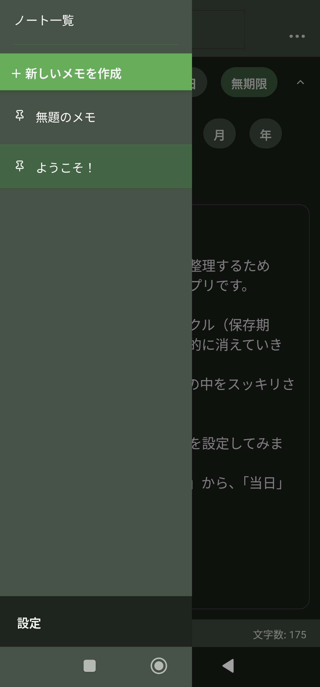
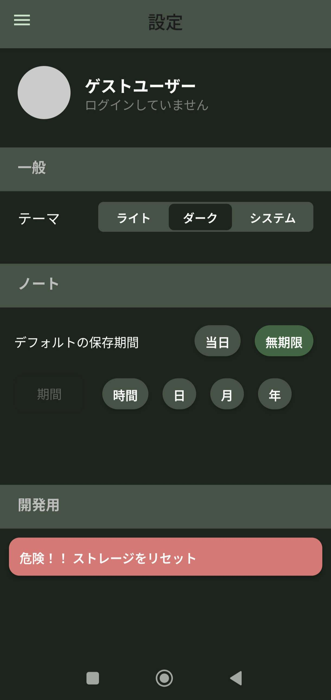

# Register - 一時的メモアプリ


## プロジェクト概要

**Register**は、コンピュータサイエンスの「レジスタ」概念を応用した一時的メモアプリです。従来のメモアプリが長期保存に特化している中、このアプリは「一時的な記録」と「自動削除」に特化することで、新しいユーザー体験を提供します。

### 開発動機・コンセプト

- **問題意識**: 買い物メモや駐車場の場所など、短期的なメモを長期保存型のアプリに保存することへの心理的抵抗
- **解決アプローチ**: CPUレジスタの「一時保存」「自動上書き」の特性をUXに応用
- **目標**: メモの「忘れる」機能により、ユーザーの認知負荷を軽減

### 想定ユースケース

1. **短期メモ**: 買い物リスト、駐車場の場所、待ち合わせ時間など
2. **デバイス間データ転送**: スマホ→PC間でのテキスト共有（※バックエンド実装により実現予定）
3. **一時的な計算結果**: コピペ用の計算結果や変換値の保存

## デモ・インストール

**Android APKダウンロード**: 
- [Expo Build Link](https://expo.dev/accounts/kite0328/projects/frontend/builds/eed771ab-74f7-455b-8b98-837e52580140)

> **注意**: 開発者署名のため、Androidで「不明なアプリ」の警告が表示される場合があります。以下のスクリーンショットからもアプリの様子を確認することが出来ます。

## スクリーンショット

### ホーム画面・メモ作成
<div align="center">
  
  
</div>

*アプリを開いた時の初期画面と新しいメモの作成画面*
<div align="center">
  
</div>

*ケバブメニュー*

### サイドメニュー・設定画面
<div align="center">
  
  
</div>

*ドロワーメニューでのメモ一覧と設定画面*

### ダーク/ライトテーマ対応
<div align="center">
  
  
  
</div>

*デザインシステムの実装例：ダークテーマとライトテーマの両対応*

## 主な技術的特徴

###  アーキテクチャ設計
- **独自デザインシステム**: Design Token System による一貫したUI実装
- **状態管理**: React Context + Custom Hooks による効率的な状態管理
- **型安全性**: TypeScript による堅牢な型システム

### UX/UI設計
- **即座のメモ作成**: アプリ起動と同時に新規メモが作成される UX
- **自動ライフサイクル**: 期限に基づく自動削除機能
- **レスポンシブデザイン**: ダーク/ライトテーマ完全対応

### 技術的工夫
- **デバウンス自動保存**: ユーザー入力の効率的な保存処理
- **期限切れ検出**: アプリ起動時の自動クリーンアップ機能  
- **コンポーネント設計**: Base → Composite → Screen の3層アーキテクチャ

###  使い方

#### 基本操作

1. **新しいメモを作成**
   - アプリを開くと自動的に新しいメモが作成されます
   - サイドメニューの「新しいメモ」ボタンからも作成可能

2. **メモの編集**
   - タイトルと本文を自由に編集できます
   - 変更は自動的に保存されます

3. **ライフサイクル設定**
   - メモの上部でライフサイクル（削除タイミング）を設定
   - 「無期限」「当日」「1時間後」「3日後」など柔軟に設定可能

4. **メモの管理**
   - ピン留め: 重要なメモを上部に固定表示
   - サイドメニューでメモ一覧を確認
   - スワイプで削除操作

#### ライフサイクル機能の詳細

- **無期限**: メモを手動で削除するまで保持
- **当日**: その日の終わり（23:59）に自動削除
- **時間指定**: 1〜23時間後に削除
- **日数指定**: 1〜30日後に削除
- **月数指定**: 1〜11ヶ月後に削除
- **年数指定**: 1〜10年後に削除

---

## 技術スタック

### フロントエンド
```
React Native + Expo        # クロスプラットフォーム開発
TypeScript                 # 型安全な開発
Expo Router                # ファイルベースルーティング
React Navigation           # ネイティブナビゲーション
AsyncStorage              # ローカルデータ永続化
Lucide React Native       # アイコンライブラリ
React Native Reanimated   # 高性能アニメーション
```

### 開発環境・ツール
```
ESLint + Prettier         # コード品質管理
Jest + Testing Library    # テスト自動化
Expo CLI                  # 開発・デプロイツール
TypeScript                # 型チェック
```

## アーキテクチャ設計

### プロジェクト構造
```
frontend/src/
├── app/                    # 📱 Screen Layer (Expo Router)
│   ├── _layout.tsx         # ルートレイアウト・Provider設定
│   ├── settings.tsx        # 設定画面
│   ├── index.tsx          # ホーム画面（新規メモ作成）
│   └── note/[id].tsx      # メモ詳細・編集画面
├── components/             #  Composite Layer
│   ├── Drawer/            # ドロワーナビゲーション
│   ├── Header/            # ヘッダーコンポーネント群
│   ├── Lifecycle/         # ライフサイクル設定UI
│   ├── editor/            # メモエディター機能群
│   └── settings/          # 設定画面コンポーネント群
├── base/                  # 🔧 Base Layer
│   ├── BaseView.tsx       # StyleKit対応ビュー
│   ├── BaseText.tsx       # StyleKit対応テキスト
│   └── BaseTextInput.tsx  # StyleKit対応入力フィールド
├── contexts/              #  State Management
│   ├── NotesContext.tsx   # メモデータ管理
│   └── SettingsContext.tsx # アプリ設定管理
├── hooks/                 #  Business Logic
│   ├── useNotes.ts        # メモ操作ロジック
│   └── useThemeColor.ts   # テーマ管理ロジック
├── styles/                #  Design System
│   ├── tokens/            # Design Tokens
│   │   ├── color/         # カラーシステム
│   │   ├── size/          # サイズシステム
│   │   └── shadow/        # シャドウ定義
│   └── component/         # コンポーネントスタイル
├── types/                 #  Type Definitions
└── utils/                 # Utilities
    └── LifeCycleUtils.ts  # ライフサイクル計算ロジック
```

### 設計思想・技術的な工夫

#### 1. Design Token System
```typescript
// 階層構造: Tokens → Component Styles → UI Components
<Button
  viewStyleKit={{
    color: { colorKey: CoreColorKey.Primary },
    size: { sizeKey: SizeKey.LG }
  }}
/>
```
- **一貫性**: 全コンポーネントで統一されたデザイン言語
- **保守性**: Design Tokenの変更がアプリ全体に自動反映
- **拡張性**: 新しいトークンの追加が容易

#### 2. 3層アーキテクチャ
- **Base Layer**: React Nativeコンポーネントの薄いラッパー
- **Composite Layer**: ビジネスロジックを含む機能コンポーネント  
- **Screen Layer**: ページレベルの構成とナビゲーション

#### 3. 状態管理パターン
```typescript
// Context + Custom Hooks パターン
const { notes, createNote, deleteNote } = useNotes();
```
- **責任分離**: Contextは状態、Hooksはロジック
- **テスタビリティ**: ロジックの単体テストが容易
- **再利用性**: 複数コンポーネントでのロジック共有

##  開発・ビルド

### クイックスタート
```bash
# リポジトリクローン
git clone <repository-url>
cd register/frontend

# 依存関係インストール
npm install

# 開発サーバー起動
npm run dev
```

### プラットフォーム別実行
```bash
npm run android    # Android エミュレーター/実機
npm run ios        # iOS シミュレーター/実機  
npm run web        # Web ブラウザ
npm start          # Expo開発サーバー起動
```

### ビルド・デプロイ
```bash
# EAS Build (推奨)
npx eas build --platform android
npx eas build --platform ios

# 従来のビルド方法（非推奨）
expo build:android   # Android APK
expo build:ios       # iOS IPA
```

### 開発ツール
```bash
npm run lint           # ESLint実行
npm run test           # Jest テスト実行
npm run test:watch     # テスト監視モード
npm run test:coverage  # カバレッジ付きテスト
npm run reset-project  # プロジェクトリセット
```

## 今後の発展計画
- **バックエンド開発**: Node.js + Express による API サーバー構築予定
- **リアルタイム同期**: WebSocket を活用したデバイス間同期機能
- **テスト充実**: E2E テスト、パフォーマンステストの実装
